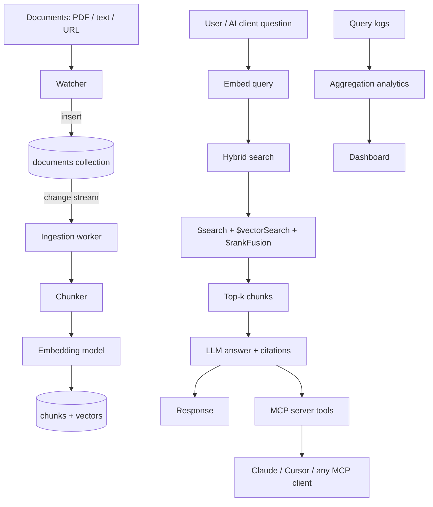

# Cogito

## An MCP-Powered RAG Knowledge Assistant

**A self-indexing knowledge base that any AI can query.**

Cogito is a MongoDB-native Retrieval-Augmented Generation (RAG) system with three
defining traits:

1. **Auto-ingestion** — documents index themselves. Drop a file in, a change stream
   detects it, chunks it, embeds it, and stores it. No manual indexing.
2. **Hybrid search** — every query is answered by fusing keyword precision
   (`$search`) with semantic understanding (`$vectorSearch`), ranked together via
   `$rankFusion`.
3. **MCP exposure** — the whole assistant is wrapped as a Model Context Protocol
   (MCP) server, so Claude Desktop, Cursor, or any MCP client can use your knowledge
   base as a tool.

The name is deliberate: *Cogito* (Latin, "I think") is a system that does not just
store knowledge, it reasons over it.

---

## 1. The Problem

Knowledge lives in messy places: PDFs, contracts, notes, wikis, chat logs. Three
things are simultaneously true of almost every organization and student:

- **Search is brittle.** Keyword search misses things that are *about* a topic but
  do not use the exact words. Ask "late delivery penalties" and you miss the
  paragraph titled "vendor obligations."
- **Indexing is manual.** Existing RAG systems require a script, a cron job, or a
  human to re-ingest every time a document changes. Data goes stale silently.
- **The knowledge is siloed.** A knowledge base is only useful if the tools people
  already use (their AI assistant, their IDE) can reach it. A standalone chatbot is
  an island.

Cogito attacks all three at once: semantic retrieval fixes brittle search, change
streams make indexing automatic, and MCP makes the knowledge reachable from any AI
client.

---

## 2. What Cogito Does (End to End)

A concrete walk-through:

1. A user drops `acme_vendor_contract_2026.pdf` into a watched folder.
2. A MongoDB **change stream** fires on the new `documents` entry.
3. A worker **chunks** the text into overlapping passages, generates **embeddings**
   for each, and stores chunk + vector + source metadata in MongoDB.
4. The user asks: *"What are our penalty clauses for late delivery?"*
5. The query is embedded. A **hybrid search** runs:
   - `$search` finds chunks containing "penalty" and "late delivery" (keyword).
   - `$vectorSearch` finds chunks *semantically* about penalties (semantic).
   - `$rankFusion` merges both result sets into one ranked list.
6. The top `k` chunks are passed to an LLM, which writes an answer **with citations**
   to the exact source document and page.
7. The same answer is available three ways: the web UI, the REST API, and — because
   Cogito is an MCP server — any MCP-capable AI client.

---

## 3. Feature Set

Features are organized in three tiers. Tier 1 and Tier 2 are the core. Tier 3 turns
Cogito from "a good RAG demo" into "a system."

### Tier 1 — Core RAG

- **Auto-ingestion pipeline** — change streams detect new/updated documents and
  trigger chunking, embedding, and storage with zero manual steps.
- **Chunking** — recursive text splitting with overlap, tuned per document type.
- **Embedding** — any embedding model (OpenAI, Gemini, Voyage, or local Ollama)
  stored as BSON arrays.
- **Hybrid search** — `$search` (lexical) + `$vectorSearch` (semantic) + `$rankFusion`
  (fusion), run inside a single MongoDB aggregation pipeline.
- **Cited answers** — the LLM is required to ground every claim in retrieved chunks
  and return source references.

### Tier 2 — MCP Integration

- **Outbound (Cogito as an MCP server)** — a custom MCP server exposes Cogito's
  capabilities as tools:
  - `add_document(path)` — ingest and index a document.
  - `search_knowledge(query, k)` — run hybrid search, return ranked chunks.
  - `ask_question(question)` — return a grounded, cited answer.
  - `list_sources()` — enumerate what is indexed.
- **Inbound (MongoDB MCP server)** — the assistant can itself use MongoDB's official
  MCP server so the agent decides what to query and aggregate rather than calling
  hard-coded functions. This is the bridge to the agentic tier.

The result: open Claude Desktop or Cursor, ask a question about your documents, and
the AI calls Cogito's tools to answer. The knowledge base is no longer a separate
app; it is a capability any AI can invoke.

### Tier 3 — Advanced

1. **Reranking (`$rerank`)** — a second-pass ranker keeps only the most relevant
   chunks, improving answer quality and cutting LLM token cost.
2. **Agentic loop (LangGraph)** — the assistant reasons in steps: retrieve, assess
   confidence, re-query with a refined prompt if weak, optionally run an aggregation
   (e.g., "how many contracts mention this clause"), then answer.
3. **Memory** — conversation history plus extracted long-term facts stored with
   embeddings, recalled via vector search (MongoDB's "agent memory" pattern).
4. **Evaluation pipeline** — an LLM judge scores each answer for faithfulness
   (is it grounded?) and relevance (did it answer?); scores are stored and tracked
   over time.
5. **Feedback loop** — thumbs-up/down on answers feed back into retrieval ranking.
6. **Multimodal ingestion** — PDFs with images, tables, and charts are handled with
   OCR/vision; text and image embeddings live side by side.
7. **Analytics dashboard** — aggregation over query logs surfaces top questions,
   unanswered queries (which reveal ingestion gaps), and usage trends.
8. **Multi-tenant namespaces** — per-user or per-team scoping with read-only modes.

---

## 4. Architecture



The flow has two halves joined by MongoDB:

- **Write path (top):** documents flow in and index themselves.
- **Read path (bottom):** questions flow in and come back as grounded answers.

Everything — documents, chunks, vectors, memory, logs, evaluations — lives in one
MongoDB deployment. No separate vector database, no separate search engine, no sync
tax.

---

## 5. Data Model

All data is stored in MongoDB. Vector search and full-text search run natively.

| Collection | Purpose | Key fields |
|---|---|---|
| `documents` | source docs + metadata | `_id`, `path`, `title`, `type`, `hash`, `status`, `ingested_at` |
| `chunks` | text passages | `_id`, `document_id`, `text`, `embedding` (vector), `page`, `token_count` |
| `conversations` | chat history | `_id`, `user_id`, `messages[]`, `created_at` |
| `memories` | long-term facts | `_id`, `user_id`, `fact`, `embedding`, `importance`, `updated_at` |
| `query_logs` | every query | `_id`, `question`, `chunks_returned`, `latency_ms`, `answer_id`, `ts` |
| `eval_results` | answer scoring | `_id`, `answer_id`, `faithfulness`, `relevance`, `judge`, `ts` |
| `feedback` | user ratings | `_id`, `answer_id`, `rating`, `comment`, `ts` |

### Indexes

- **Vector index** on `chunks.embedding` (e.g., HNSW) for `$vectorSearch`.
- **Atlas Search / Lucene index** on `chunks.text` for `$search`.
- **Compound indexes** for common filters: `chunks(document_id)`,
  `query_logs(ts)`, `documents(status)`.

---

## 6. Hybrid Search Pipeline (deep dive)

The retrieval is a single aggregation. In pseudocode:

```
search_term = embed(question)

pipeline = [
  { $search: { index: "text", text: { query: question, path: "text" } } },
  { $limit: 50 },
  {
    $vectorSearch: {
      index: "vector",
      path: "embedding",
      queryVector: search_term,
      numCandidates: 100,
      limit: 50
    }
  },
  {
    $rankFusion: {
      input: [ { $search: {...} }, { $vectorSearch: {...} } ]
    }
  },
  { $limit: k },
  { $project: { text: 1, document_id: 1, page: 1, score: 1 } }
]
```

Why this beats either approach alone:

- A user searching "winter wedding outfit" would miss a product described as
  "formal cold-weather gown" with pure keyword search.
- A user searching for an exact clause number "4.2" would be misled by pure
  semantic search, which does not do exact matching well.
- `$rankFusion` combines both signal types, so exact matches and semantic matches
  both surface in the right order.

---

## 7. MCP Integration (detail)

### Cogito as an MCP server

Cogito ships a small MCP server (built on the MCP TypeScript or Python SDK) that
exposes four tools:

```
tool: add_document
  params: { path: string }
  returns: { document_id, chunks_created, status }

tool: search_knowledge
  params: { query: string, k?: int }
  returns: [ { text, source, page, score } ]

tool: ask_question
  params: { question: string }
  returns: { answer, citations: [ { source, page, excerpt } ] }

tool: list_sources
  params: {}
  returns: [ { document_id, title, chunks } ]
```

Any MCP client (Claude Desktop, Cursor, Gemini CLI, Codex) can register Cogito and
immediately gain access to the knowledge base. This is the "wow" moment of the
project: the user's existing AI assistant suddenly knows their documents.

### Using MongoDB's official MCP server

MongoDB ships `mongodb-mcp-server`, which exposes tools like `find`, `aggregate`,
`insert-many`, `update-many`, and `collection-schema`. In the agentic tier, Cogito's
agent calls these tools directly, so the LLM decides — at runtime — whether to run a
hybrid search, a `$graphLookup`, or an aggregation, rather than following fixed code
paths.

---

## 8. Tech Stack

| Layer | Choice | Notes |
|---|---|---|
| Database | MongoDB Community Edition 8.2+ | free, unlimited, ships `$search` + `$vectorSearch` + `$rankFusion` |
| Backend | Python + FastAPI | matches existing repo, async-friendly |
| Ingestion | change streams + worker | `watch()` on `documents` |
| Chunking | LangChain text splitters | recursive + overlap |
| Embeddings | OpenAI / Gemini / Ollama | pluggable |
| LLM | OpenAI / Gemini / Ollama | pluggable |
| Agent framework | LangGraph | for the agentic tier |
| MCP server | MCP Python/TS SDK | outbound tools |
| Frontend (optional) | React / Streamlit | simple chat + sources UI |
| Dashboards | Atlas Charts / custom aggregation UI | analytics |

---

## 9. Free-Tier Strategy

The project is designed to run entirely free. Two deployment options:

| | Community Edition 8.2+ (self-hosted) | Atlas M0 (managed) |
|---|---|---|
| Cost | $0 | $0 |
| Vector + hybrid search | Full (`$vectorSearch`, `$search`, `$rankFusion`) | Limited (`$search` needs M10+) |
| Storage / throughput | Unlimited | 512 MB, 100 ops/sec |
| Setup | Run `mongod` + `mongot` (Docker) | Sign up, click deploy |
| Best for | The full feature set, demos | Quick prototypes |

**Recommendation:** self-host Community Edition 8.2+ so the flagship hybrid-search
features work without limits. It runs in a single Docker container and is the same
binary family you would use in production.

---

## 10. Build Roadmap

| Milestone | Deliverable | Est. effort |
|---|---|---|
| M1 | MongoDB 8.2+ running (Docker) + driver connected | 0.5 day |
| M2 | Ingestion: change stream -> chunk -> embed -> store + vector/text indexes | 2 days |
| M3 | Hybrid search + cited answers (Tier 1 done) | 2 days |
| M4 | MCP server wrapping the assistant, tested in Claude Desktop/Cursor (Tier 2 done) | 2 days |
| M5 | Agentic loop + memory (LangGraph) | 2 days |
| M6 | Evaluation pipeline + feedback loop | 1.5 days |
| M7 | Analytics dashboard over query logs | 1.5 days |
| M8 | Multimodal ingestion + reranking + polish | 2 days |

**Total: roughly two focused weeks**, front-loaded so the core (M1-M4) is demoable
after the first week.

---

## 11. Evaluation & Success Metrics

- **Retrieval quality** — recall@k on a small labeled query set; did the relevant
  chunk surface in the top `k`?
- **Answer faithfulness** — LLM-judge score: is every claim supported by a retrieved
  chunk? (hallucination guard).
- **Answer relevance** — LLM-judge score: does the answer actually address the query?
- **Freshness** — latency between dropping a document and it being queryable
  (should be seconds, thanks to change streams).
- **Usage** — query volume and unanswered-query rate from the analytics dashboard.

---

## 12. Risks & Mitigations

| Risk | Mitigation |
|---|---|
| Chunking quality hurts retrieval | Tune chunk size/overlap per document type; test with recall@k |
| LLM hallucination | Citations required; faithfulness eval scores every answer |
| Embedding/LLM API cost | Pluggable provider; Ollama for fully local, free |
| Free-tier limits (if Atlas M0) | Prefer self-hosted Community Edition |
| Change-stream worker restarts lose events | Resume tokens persisted so ingestion is durable |

---

## 13. Why This Project Stands Out

- It uses MongoDB's **flagship AI features** (`$vectorSearch`, `$search`,
  `$rankFusion`, `$rerank`) end to end — not just CRUD.
- It is **event-driven** (change streams) rather than batch, which is genuinely
  harder and more impressive.
- It is **MCP-native**, the hottest integration in 2026 — the knowledge base becomes
  a tool for any AI, not a separate app.
- It is **free to build and run** on Community Edition, with a real architecture that
  maps to production (RAG + agents + memory + evaluation).

*Cogito, ergo sum.* — the system that reasons over what it knows.
